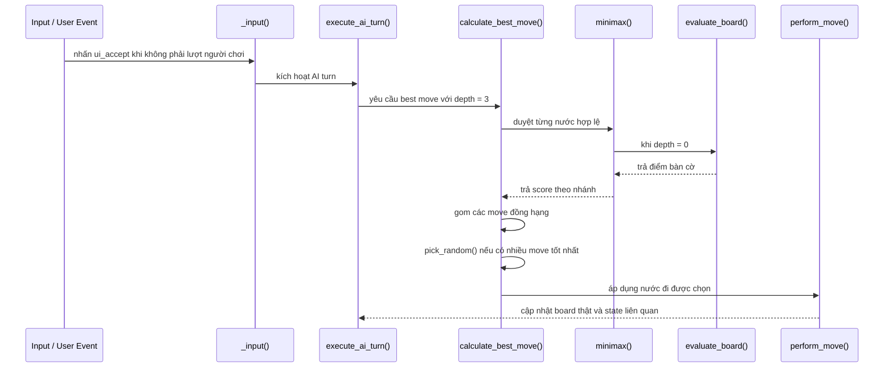

# Mô Hình Luồng Thuật Toán AI: Kích Hoạt Lượt -> Minimax -> Alpha-Beta -> Chọn Nước Đồng Hạng

Tài liệu này mô tả toàn bộ luồng xử lý của AI trong hệ thống cờ của Rematch, từ lúc AI được kích hoạt lượt đi, dựng cây tìm kiếm Minimax, cắt tỉa Alpha-Beta, cho đến bước chọn ngẫu nhiên nếu có nhiều nước đi có chất lượng tương đương.

## Mục tiêu

- Xác định nước đi tốt nhất cho AI trong một độ sâu tìm kiếm cho trước.
- Giảm số nhánh phải duyệt bằng Alpha-Beta pruning.
- Tránh hành vi máy móc bằng cách chọn ngẫu nhiên giữa các nước đồng hạng.

## Luồng tổng quát

```mermaid
flowchart TD
    A[AI nhận kích hoạt lượt đi] --> B[execute_ai_turn()]
    B --> C[calculate_best_move(depth = 3)]
    C --> D[Sinh danh sách nước đi hợp lệ]
    D --> E[Duyệt từng move bằng Minimax]
    E --> F[apply_simulated_move() / mô phỏng trạng thái]
    F --> G{Độ sâu = 0?}
    G -- Có --> H[evaluate_board()]
    G -- Không --> I[minimax(depth-1)]
    I --> J{is_maximizing?}
    J --> K[Nhánh White: maximize]
    J --> L[Nhánh Black: minimize]
    K --> M[Update alpha]
    L --> N[Update beta]
    M --> O{beta <= alpha?}
    N --> O
    O -- Có --> P[Cắt tỉa nhánh]
    O -- Không --> E
    H --> Q[Trả điểm đánh giá]
    Q --> R[So sánh best_score]
    R --> S{Nước mới gần bằng best_score?}
    S -- Có --> T[Thêm vào best_moves]
    S -- Không --> U[Cập nhật best_score và best_moves]
    T --> V{Có nhiều best_moves?}
    U --> V
    V -- Có --> W[pick_random()]
    V -- Không --> X[Trả về move tốt nhất]
    W --> Y[perform_move(from, to)]
    X --> Y
    Y --> Z[Đổi lượt / kết thúc lượt AI]
```

## 1. Kích hoạt lượt AI

Luồng bắt đầu khi người chơi gửi input `ui_accept` trong lúc không phải lượt người chơi:

- `_input(event)` phát hiện phím kích hoạt.
- Nếu `not is_player_turn`, hàm gọi `execute_ai_turn()`.

Đây là điểm vào của toàn bộ quy trình tìm nước.

## 2. Chọn nước đi tốt nhất

Trong `execute_ai_turn()`:

- Gọi `calculate_best_move(3)`.
- `3` là độ sâu tìm kiếm mặc định hiện tại.
- Nếu có kết quả, gọi `perform_move(best_move.from, best_move.to)` để áp dụng nước đi thật lên bàn cờ.
- Cuối cùng trả lượt về cho người chơi.

## 3. Dựng cây Minimax

`calculate_best_move(depth)` tạo danh sách các nước đi hợp lệ cho AI, sau đó duyệt từng nước bằng cách mô phỏng trạng thái bàn cờ.

Ý tưởng chính:

- với mỗi ứng viên `move`:
  - lưu bản sao trạng thái hiện tại,
  - mô phỏng nước đi,
  - gọi `minimax(depth - 1, alpha, beta, ...)`,
  - hoàn tác lại trạng thái để thử nước tiếp theo.

Nhờ vậy, AI xây dựng một cây tìm kiếm theo kiểu đệ quy mà không làm hỏng trạng thái thật.

## 4. Hàm đánh giá lá cây

Khi `depth == 0`, `minimax()` gọi `evaluate_board()`.

`evaluate_board()` tính điểm bàn cờ bằng cách:

- duyệt toàn bộ `piece_placement`,
- lấy giá trị cơ bản của từng quân từ `piece_values`,
- cộng thêm bonus vị trí `get_piece_stats_value(...)`,
- cộng thêm hệ số tấn công từ `ATTACKS`,
- cộng điểm cho quân trắng và trừ điểm cho quân đen.

Kết quả là một số điểm đại diện cho lợi thế tương đối của bàn cờ.

## 5. Alpha-Beta pruning

`minimax(depth, alpha, beta, is_maximizing)` dùng Alpha-Beta để giảm số nhánh phải xét:

- `alpha` là điểm tốt nhất đã thấy cho nhánh tối đa hóa.
- `beta` là điểm tốt nhất đã thấy cho nhánh tối thiểu hóa.
- Nếu `beta <= alpha`, nhánh hiện tại bị cắt tỉa vì không thể cải thiện kết quả cuối.

### Nhánh White

- `is_maximizing = true`.
- Duyệt các nước đi để lấy `max_eval`.
- Sau mỗi nước, cập nhật `alpha = max(alpha, eval)`.
- Nếu `beta <= alpha`, dừng sớm.

### Nhánh Black

- `is_maximizing = false`.
- Duyệt các nước đi để lấy `min_eval`.
- Sau mỗi nước, cập nhật `beta = min(beta, eval)`.
- Nếu `beta <= alpha`, dừng sớm.

## 6. Mô phỏng và hoàn tác trạng thái

Để cây tìm kiếm hoạt động an toàn, mỗi nhánh phải mô phỏng nước đi trên bản sao trạng thái.

Trong code hiện tại:

- `piece_placement.duplicate()` dùng để lưu lại trạng thái trước khi thử một move.
- `apply_simulated_move(m.from, m.to)` cập nhật board tạm.
- Sau khi đánh giá xong, `piece_placement = temp` để khôi phục.
- Với nhánh có `en_passant_square`, giá trị này cũng được sao lưu và phục hồi riêng.

Đây là bước bắt buộc để Minimax không làm rò rỉ trạng thái sang các nhánh khác.

## 7. Chọn ngẫu nhiên nước đồng hạng

Sau khi đánh giá tất cả ứng viên, `calculate_best_move()` không chỉ giữ một nước tốt nhất duy nhất.

Thay vào đó:

- Nếu điểm số mới thấp hơn `best_score`, thay toàn bộ danh sách `best_moves`.
- Nếu điểm số mới gần bằng `best_score` trong ngưỡng sai khác nhỏ, thêm move đó vào `best_moves`.
- Cuối cùng nếu `best_moves.size() > 0`, trả về `best_moves.pick_random()`.

### Ý nghĩa

Điều này làm AI bớt lặp lại hành vi cứng nhắc khi có nhiều phương án ngang điểm nhau. Về mặt chiến thuật, các nước đó được coi là tương đương trong phạm vi độ sâu hiện tại.

## 8. Dòng dữ liệu chi tiết



## 9. Kết quả cuối cùng

Khi luồng chạy xong, AI có:

- một nước đi hợp lệ được chọn từ cây Minimax,
- khả năng cắt tỉa nhánh để tiết kiệm tính toán,
- hành vi đa dạng hơn nhờ random giữa các nước đồng hạng,
- trạng thái bàn cờ thật được cập nhật qua `perform_move()`.

## 10. Ghi chú triển khai

- Độ sâu `3` là tham số thực dụng cho tốc độ và chất lượng hiện tại.
- Việc clone và hoàn tác trạng thái phải được giữ nhất quán cho cả `piece_placement` và các biến phụ như `en_passant_square`.
- Nếu muốn AI mạnh hơn, có thể tăng độ sâu, nhưng chi phí tính toán sẽ tăng rất nhanh.
