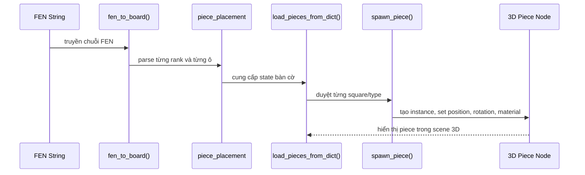

# Mô Hình Luồng Dữ Liệu FEN -> piece_placement -> 3D

Tài liệu này mô tả luồng dữ liệu dùng trong hệ thống bàn cờ của Rematch để chuyển một chuỗi FEN thành cấu trúc từ điển logic `piece_placement`, rồi từ đó sinh ra các mô hình 3D tương ứng.

## Mục tiêu

- Chuẩn hóa trạng thái bàn cờ từ chuỗi FEN.
- Lưu trạng thái đó vào dictionary logic theo từng ô cờ.
- Dùng dictionary này để spawn mô hình 3D và gán vật liệu, hướng quay, vị trí trong thế giới.

## Luồng tổng quát

```mermaid
flowchart LR
    A[FEN string] --> B[fen_to_board()]
    B --> C[piece_placement : Dictionary]
    C --> D[load_pieces_from_dict() / test_spawn_starting_board()]
    D --> E[spawn_piece(type, square)]
    E --> F[Instance 3D piece scene]
    F --> G[Set position, orientation, material]
    G --> H[Board rendered in 3D]
```

## 1. Đầu vào: chuỗi FEN

Phần quan trọng nhất của FEN trong luồng này là **piece placement**. Ví dụ:

```text
RNBKQBNR/PPPPPPPP/8/8/8/8/pppppppp/rnbkqbnr
```

Mỗi hàng được ngăn bằng dấu `/` và các số đại diện cho số ô trống liên tiếp.

## 2. Parse FEN thành `piece_placement`

Trong `fen_to_board(fen)`:

- Xóa trạng thái cũ bằng `piece_placement.clear()`.
- Tách phần piece placement bằng `fen.split(" ")[0]`.
- Tách tiếp từng rank bằng `split("/")`.
- Duyệt từ rank 8 xuống rank 1 theo chỉ số đảo `ranks[7 - z]`.
- Với mỗi ký tự:
  - Nếu là số, tăng `x` thêm số ô trống tương ứng.
  - Nếu là quân cờ, ghi vào dictionary theo khóa ô cờ.

### Cấu trúc dictionary logic

```gdscript
piece_placement = {
    "a1": "r",
    "b1": "n",
    "c1": "b",
    "d1": "k",
    "e1": "q"
}
```

Trong đó:

- key là ký hiệu ô cờ như `a1`, `e4`, `h8`
- value là ký hiệu quân cờ theo FEN
- chữ hoa thường được dùng để phân biệt màu quân

## 3. Từ dictionary sang mô hình 3D

Sau khi có `piece_placement`, hệ thống dùng hàm như `load_pieces_from_dict()` hoặc đoạn test trong `test_spawn_starting_board()` để đi qua từng ô:

- Lấy `square` và `type` từ dictionary.
- Gọi `spawn_piece(type, square)`.

Trong `spawn_piece()`:

- Chọn `PackedScene` phù hợp từ `scene_map`.
- `instantiate()` một node mô hình cờ.
- Đặt `global_position` dựa trên `board_to_cord[square]`.
- Nâng trục Y để piece không bị chìm vào mặt bàn.
- Xác định hướng nhìn theo màu quân.
- Gán material trắng/đen.
- Lưu reference vào `piece_nodes[square]`.

## 4. Dòng dữ liệu chi tiết



## 5. Vai trò của `piece_placement`

`piece_placement` là lớp trung gian giữa dữ liệu text và thế giới 3D. Nó giúp:

- kiểm tra ô nào đang có quân,
- sinh legal moves,
- kiểm tra ô bị tấn công,
- undo/redo trạng thái khi cần,
- đồng bộ logic bàn cờ với node 3D.

## 6. Kết quả đầu ra

Khi luồng hoàn tất, hệ thống có:

- một dictionary logic đại diện trạng thái bàn cờ,
- các node 3D đã được spawn đúng vị trí,
- vật liệu và hướng quay đúng theo màu quân,
- sẵn sàng cho chọn quân, di chuyển và AI.

## 7. Ghi chú triển khai

- Hàm `gen_fen()` có thể sinh lại FEN từ trạng thái hiện tại của bàn cờ.
- Việc dùng dictionary giúp kiểm tra trạng thái nhanh và tách rõ logic khỏi hiển thị.
- Nếu sau này mở rộng bàn cờ khác kích thước, phần parse rank và ánh xạ tọa độ cần được tổng quát hóa.
